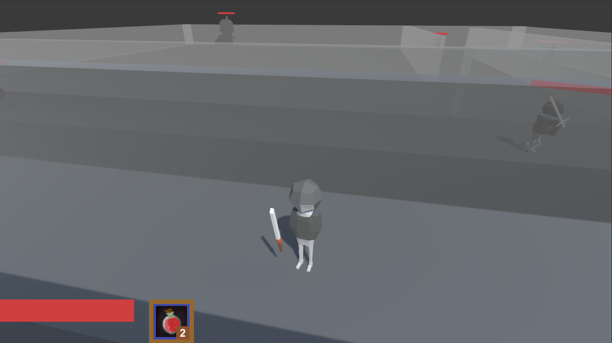

# 프로젝트 소개
- 제작 기간: 3주

</img>  

## 3D RPG 게임 기능 구현
- 플레이어는 미로를 헤쳐 나가며 적을 처치하여 아이템을 얻고, 최종적으로 보스를 공략하는 간단한 게임입니다.  기본적인 RPG의 기능들을 구현해 보았습니다.  

## -플레이 영상-
플레이 영상: <https://www.youtube.com/watch?v=ZUvLc5ImEkc>

### 주요 기능 구현
1. 인벤토리 기능
2. 인벤토리 내 아이템 드래그 및 스위칭
3. 물약 퀵 슬롯 기능
4. 장비 탈/장착에 따른 능력치 변화
5. 장비 탈/장착에 따른 플레이어 외형 변화
6. 상태 패턴을 이용한 적 AI 구현
7. 아이템 드랍 기능
8. 보스 지역 진입 시의 카메라 무브
9. 튜토리얼 형태의 가이드 메시지 기능
10. 키보드 마우스를 통한 조작