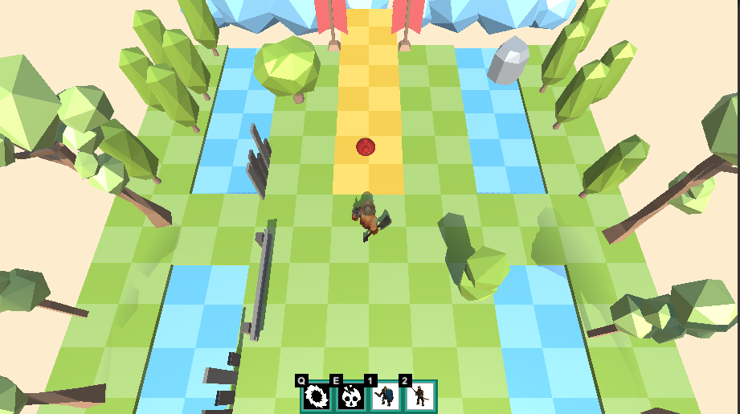

# 프로젝트 소개
- 제작 기간: 3주
## 핵앤슬래시 장르의 게임 개발
- 플레이어는 범위 스킬과 유닛을 소환/배치하여 타워에서 생산되는 다수의 몬스터를 처치하고 타워를 파괴해 마무리하는 게임입니다.  
</img> 
</img>
</img>  

## 플레이 영상
[플레이 영상](https://www.youtube.com/watch?v=xhsWvPpqIr8&t=3s)

### 주요 기능 구현
1. 마우스 클릭 이동 및 공격 기능
2. 유닛 FSM 구현 - 탐색 -> 추격 -> 공격
3. 범위 스킬 구현
4. 아군 유닛 소환 및 배치 기능
5. 오브젝트 풀링 기법 적용
6. 타워에서의 몬스터 스폰 기능
7. 간단한 로딩씬 구현