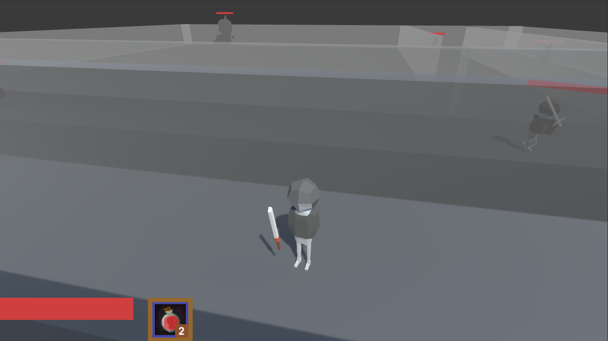

# 좀비 학살자 (Zombie Slayer)
</img>

## 플레이 영상

## 프로젝트 소개

## 주요 기능 소개

## 추가 설명
### 라이트맵 활용
### 애니메이션 분리
- 보조무기와 주무기의 애니메이션을 분리하여 처리
### 순위
### 구매 정보 관리
### 보조무기와 주무기 교체
### 코스튬 교체
### Gun 스크립트를 이용한 다양한 총기
- 보조무기와 주무기 모두 Gun 스크립트를 상속받고 발사 함수만 Override 하여 사용하였습니다.
### 몬스터 스폰 관리