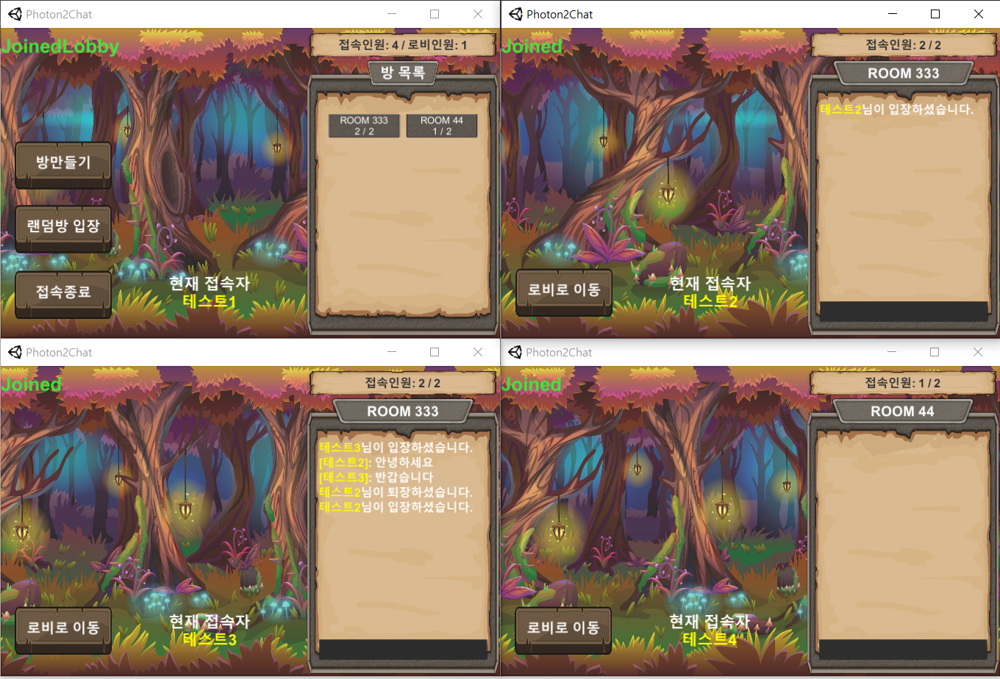

# Photon2Chat
</img>
[플레이영상](https://blog.naver.com/zoqxlstm6/221972088487)
## 프로젝트 소개
- Photon2를 활용하여 채팅 시스템 구성. 로비에서 생성된 방목록을 확인 가능하고, 방을 만들거나 생성된 방 중 랜덤으로 방에 입장하거나 방목록중 원하는 방으로 입장하여 채팅을 나누는 프로그램입니다.
## 주요 기능
- 닉네임 입력 후 포톤네트워크 시작
- 로비에서 방목록 확인 가능
    - 생성된 방, 삭제된 방, 방에 들어간 유저수 확인 가능 
- 방 생성 및 랜덤방 입장 구현
    - 현재 방의 최대 인원과 입장인원 확인 가능
- 채팅 동기화

### 주요 문제점 해결
- 로비 입장 시 OnRoomListUpdate() 콜백 함수가 두번 호출되어 삭제될 방이 그대로 남아 있고 2개이상의 방정보를 표시하지 못하는 현상
    - 초기 상황
        - 콜백함수 호출 시 모든 방정보 오브젝트를 파괴하고 콜백함수에서 반환되는 방정보 리스트를 바탕으로 방목록 갱신
    - 문제 원인
        - OnRoomListUpdate() 콜백 함수에 의해 반환되는 방정보 리스트는 모든 방정보를 반환하지 않음
        - 유지될 방과 삭제될 방의 정보를 두번 불러오기 때문에 두번 호출됨
        - 유지될 방정보와 삭제될 방정보를 두번 반환
    - 해결방법
        - OnRoomListUpdate() 콜백함수는 로비 진입시 호출되는 콜백함수인데, 현재 생성된 방의 모든 정보를 불러오는 기능이 아님
        - 정보가 업데이트된 방 중 유지될 방과 삭제될 방을 리스트로 반환
        - RemovedFromList 프로퍼티를 이용하여 삭제되는 방인지 유지되는 방인지 확인
        - 방정보 오브젝트와 같은 이름을 가진 방이 존재 하지 않을 때는 생성되는 방으로 판단하고 방정보 오브젝트 생성
        - 유지되는 방인 경우 이미 생성된 방정보를 나타내는 오브젝트의 방이름을 확인하여 방정보 오브젝트가 존재한다면 현재 입장중인 유저수만 업데이트
        - 삭제되는 방인 경우 생성되어있는 방정보 오브젝트의 방이름을 확인하여 삭제 처리

