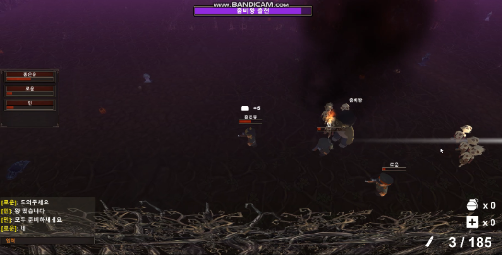
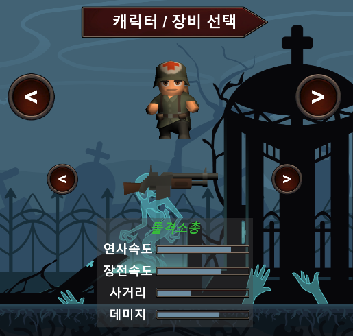
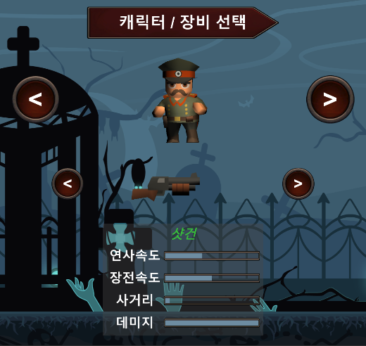
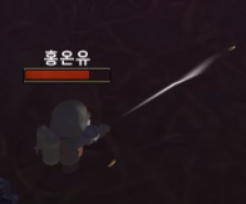
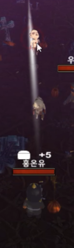
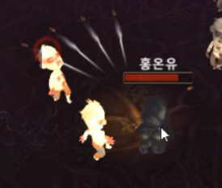
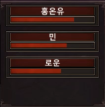
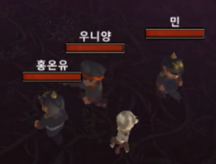
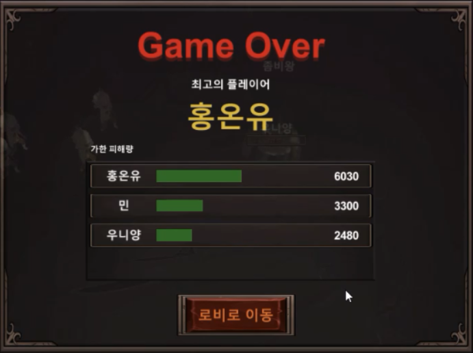
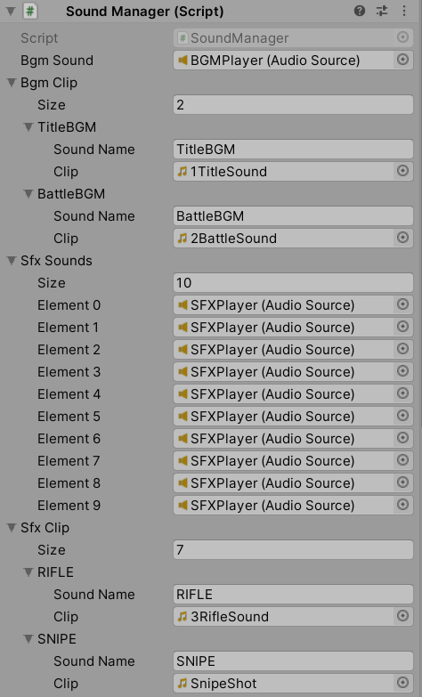

# Zombie War
</img>

## -플레이 영상-
[플레이영상](https://blog.naver.com/zoqxlstm6/221993074008)

## 프로젝트 소개
- Photon Pun2를 활용하여 네트워크를 구성하고, 최대 4명까지 수용 가능한 방에 입장하여 좀비들을 물리치고, 보스를 격파하면 승리하는 멀티 슈팅 게임입니다. 플레이어는 시작 전 원하는 캐릭터와 각각의 능력치가 다른 총기를 선택한 후 플레이하게 됩니다. 플레이 중에는 힐팩과 수류탄을 사용할 수 있고, 좀비를 처치하면 확률에 따른 아이템을 얻습니다. 게임 종료시에는 플레이시 적에게 가한 피해량을 계산하여 최고의 플레이를 뽑습니다.
## 주요 기능 소개
- Photon Pun2를 이용한 네트워크 연결
- 플레이어 캐릭터 선택 및 총기 선택 후 네트워크 동기화
- 기능이 다른 총기류 구현
- Resource 클래스를 이용한 네트워크 객체와 일반 객체 풀링
- 플레이어 및 에너미 행동 동기화
- 아이템 획득 동기화
- 아이템 획득 및 회복 UI 구현
- 파티원의 체력정보를 보여주는 UI 구현
- 아이템 드랍 테이블 구현
- 재장전 기능 구현
- 틴피효과 구현
- 힐팩 및 수류탄 구현
- 게임 종료시 플레이어들의 딜량을 집계하여 보여주는 UI 구현
- 보스 연출 구현
- 에너미들이 가장 가까운 플레이어를 찾아 이동할 수 있도록 구현
- 총알이 발사 거리만큼 이동 후 사라지도록 구현
- 플레이어 사망시 다른 파티원을 관전할 수 있는 기능 구현
- 게임 플레이 중 채팅을 사용할 수 있도록 기능 구현

### 주요 문제점 해결
1. 플레이어가 선택한 캐릭터 모델과 건모델을 자식 오브젝트로 추가해줄 때, RPC만으로는 다른 디바이스에서 초기화해줄 수 없음
    - 초기 상황
        - 선택한 캐릭터 모델과 건모델의 인덱스를 가지고 IPunObservable 인터페이스를 사용하여 동기화해줄 경우 플레이어 네트워크 객체가 생성되는 시점과 변수가 동기화되는 시간을 알 수 없어 에러사항 발생
    - 문제 원인
        - 플레이어 네트워크 객체의 생성 시점을 알 수 있다면 플레이어가 생성되었을 때, 다른 디바이스에서 캐릭터 모델 인덱스와 건모델 인덱스를 초기화 해줄 수 있음
        - 캐릭터 모델과 건모델 인덱스 초기화 시 변수 동기화가 언제 일어날 지 알 수 없어 계속 검사해 주어야함
        - 선택된 인덱스를 알기 전까지는 다른 디바이스에서 캐릭터 모델과 건모델을 생성할 수 없음
        - 플레이어 네트워크 객체 생성 시 RPC만으로는 다른 디바이스에서 선택된 캐릭터 모델과 건모델의 생성을 진행할 수 없음
    - 해결 방법
        - IPunInstantiateMagicCallback 인터페이스를 이용하여 플레이어 네크워크 객체의 생성 시점에 호출되는 OnPhotonInstantiate() 콜백 함수를 활용하여 플레이어 네트워크 객체가 만들어지는 시점 확인
        - OnPhotonInstantiate() 콜백 함수가 호출되면 그 안에서 필요한 초기화 셋팅을 진행
        - IOnEventCallback 인터페이스의 Raise Evenet를 활용하면 생성 시점에 다른 디바이스에게 캐릭터 모델과 건모델 인덱스를 전달할 수 있음
        - 선택된 인덱스 전달 후 RPC를 사용하여 다른 디바이스에 있는 플레이어 객체에게도 선택된 캐릭터 모델과 건모델을 생성하여 자식 오브젝트로 지정

2. 위 방법으로 인스턴스 생성 시 캐릭터 오브젝트의 애니메이션이 적용되지 않는 문제 발생
    - 초기 상황
        - 캐릭터 모델에게 Animator 컴포넌트를 붙인다고 해도 네트워크 객체로 생성된 것이 아니기 때문에 다른 디바이스와 애니메이션을 동기화할 수 없음
    - 문제 원인
        - 플레이어 오브젝트가 먼제 생성되고 자식 오브젝트로 캐릭터 오브젝트가 붙기 때문에 애니메이션이 적용되지 않음
    - 해결 방법
        - 플레이어, 캐릭터모델, 건모델의 오브젝트가 모두 생성된 이후 Animator 컴포넌트에 Avatar를 지정해주는 방법으로 해결

## 추가 설명
### 캐릭터 선택 및 무기 선택
- 총기류 선택시 총기가 가지고 있는 수치 정보를 확인하여 선택할 수 있습니다. Mathf.Lerp() 함수를 사용하여 생동감을 주었습니다.

</img>
</img>

### 총기에 따른 발사 방식
- 모든 총알은 Bullet 스크립트를 사용하며, 발사 방식은 Gun 스크립트에 의해 정해집니다. 총기류는 Gun 스크립트를 상속하며 발사 함수만 Override하여 총기마다의 발사 방식을 지정하였습니다.
    - 라이플류: 연사속도에 따라 총알이 발사되며, 일직선으로 날아가다 적과 충돌하면 제거됩니다.

     </img>

    - 스나이프: 사거리가 가장 길고, 총알이 일직선으로 날아가며 맞은 적에게 모두 피해를 입힙니다.

    </img>

    - 샷건: 사거리가 짧고, 총알이 다섯방향으로 발사가 됩니다.

    </img>

### 플레이어 등록
- 방에 입장한 플레이어 정보는 PlayersInfoPanel 스크립트에서 관리됩니다.
    - 플레이어 네트워크 객체 생성될 때 PlayersInfoPanel 스크립트에 플레이어를 등록합니다.
- 활용
    - 파티원 체력 정보 UI: PlayersInfoPanel 스크립트에 등록된 플레이어의 닉네임과 체력정보를 받아와 정보를 표시합니다.

    </img>

    - 플레이어 닉네임, 체력바 UI: PlayersInfoPanel 스크립트에 등록된 플레이어의 닉네임과 체력정보를 받아와 PlayerHUD 스크립트에 정보를 넘겨주고 UI가 플레이어를 따라다니도록 합니다.

    </img>

    - 딜량 집계: 동기화되고 있는 딜량 변수를 PlayersInfoPanel 스크립트에 등록된 플레이어 객체에서 받아와 표시합니다. Mathf.Lerf() 함수를 사용하여 생동감을 주었습니다.

    </img>

    - 에너미 객체가 가장 가까운 플레이어를 찾을 때: 등록된 플레이어 객체를 바탕으로 거리를 계산하여 가장 가까이에 있는 플레이어에게 이동합니다.

    ```c#
    // 플레이어 및 거리 정보 저장 클래스
    class DistanceData
    {
        public Actor actor;
        public float distance;

        public DistanceData(Actor actor, float distance)
        {
            this.actor = actor;
            this.distance = distance;
        }
    }

    /// <summary>
    /// 가까운 적을 찾는 함수
    /// </summary>
    void FindCloseTarget()
    {
        // 대상과 거리를 담을 변수
        List<DistanceData> dataList = new List<DistanceData>();

        // 등록된 player 객체 반환받음
        PlayersInfoPanel playersInfoPanel = PanelManager.GetPanel(typeof(PlayersInfoPanel)) as PlayersInfoPanel;
        List<Player> players = playersInfoPanel.Players;

        // 플레이어가 없는 경우 리턴
        if (players.Count == 0)
            return;

        // 거리 계산 후 대상과 거리를 저장
        for (int i = 0; i < players.Count; i++)
        {
            // 사망한 플레이어는 스킵
            if (players[i].IsDead)
                continue;

            float distance = Vector3.Distance(transform.position, players[i].transform.position);

            DistanceData data = new DistanceData(players[i], distance);
            dataList.Add(data);
        }

        // 거리를 기준으로 오름차순으로 정렬
        dataList.Sort((DistanceData a, DistanceData b) => { return (int)(a.distance - b.distance); });

        // 가장 가까운 플레이어를 대상으로 지정
        if (dataList.Count > 0)
            target = dataList[0].actor.transform;
        else
            target = null;
    }
    ```

### 사망시 관전
- PlayersInfoPanel 스크립트에 등록된 플레이어 객체를 활용하여 FollowCamera 스크립트의 target 변수를 변경하여 위치를 찾는 방식으로 구현하였습니다.

</img>

### Spawn 관리
- 에너미 Spawn 관리는 SpawnManager 스크립트에서 이루어집니다. 에너미 네트워크 객체는 마스터 클라이언트에서만 생성 명령을 내리고 마스터 클라이언트에서만 풀을 관리합니다.
    - 마스터클라이언트에서 스폰 함수를 실행합니다
    - 에너미 네트워크 객체는 마스터 클라이언트에서만 Update를 처리하고 다른 디바이스에서는 동기화되는 정보를 바탕으로 처리됩니다.

### 사운드 관리
- 사운드는 SoundManager 스크립트에 의해 제어됩니다. SoundManager 오브젝트는 두개의 자식 오브젝트를 가지고 있고, 각각 BGM 재생 오디오 소스를 가진 오브젝트와
SFX 재생 오디오 소스를 가진 오브젝트입니다. 오디오 클립들은 모두 SoundManager에서 관리됩니다.
    - 효과음 재생 시 SFX 재생 오디오 소스가 부착된 오브젝트에서 재생중인 아닌 오디오 소스를 찾고, 재생중이 아닌 오디오 소스가 있다면 효과음을 재생합니다.
    - 재생 가능한 오디오 소스가 없다면 오디오 소스 컴포넌트를 추가하고 효과음을 재생합니다. 추가한 오디오 소스 컴포넌트는 SFX Sounds 리스트에 추가돼 관리됩니다.

    </img>
